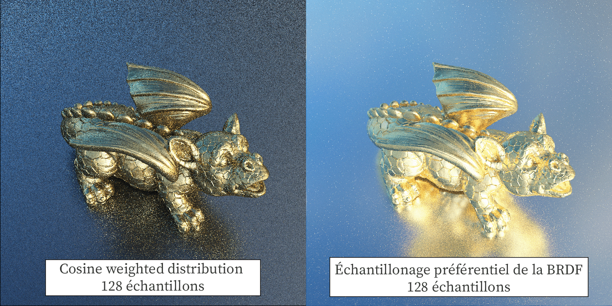
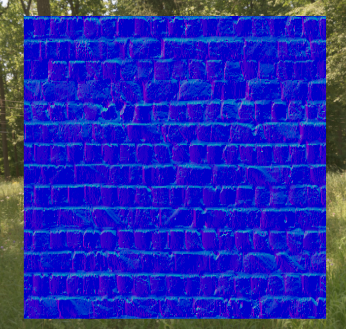
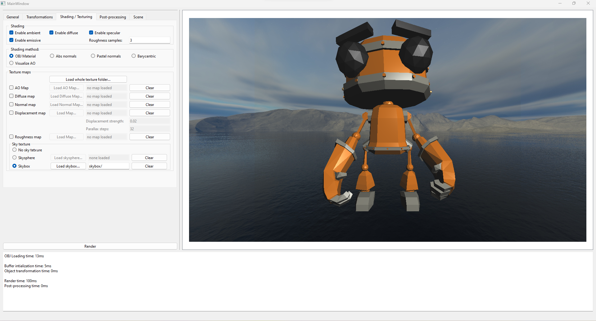

# - M2-
## \[Individuel\] (En cours) Moteur de rendu par path tracing (Monte Carlo) - C++, SYCL
[Base de code](https://github.com/TomClabault/SYCL-ray-tracing)

Moteur de rendu par path tracing (méthode de Monte Carlo) écrit en C++ dans le cadre de l'UE de synthèse d'image de la deuxième année de Master. 
Le langage recommandé pour le projet était le C++ dans sa forme la plus simple mais j'ai, par curiosité, décidé d'utiliser l'implémentation d'Intel de SYCL. SYCL est qui standard qui permet l'exécution sur CPU, GPU ou accélérateurs FPGA du même code C++ d'une application. L'utilisation de SYLC m'a donc permis d'exécuter le code de mon path tracer sur CPU ou GPU sans avoir besoin  de ne modifier quoi que ce soit dans le code de l'application.
J'ai cependant fait face à certaines complications avec SYCL (notamment au niveau des drivers Intel de mon ordinateur portable) qui m'ont poussées à devoir réécrire le code de l'application sans SYCL, en C++ sur CPU donc.

J'aimerais à terme réécrire ce path tracer sur GPU en utilisant la library [HIP RT](https://gpuopen.com/hiprt/) qui permet d'écrire des applications tirant partie des accélérateurs de ray tracing des cartes graphiques AMD RDNA2 et RDNA3. L'application pourra aussi s'exécuter sur les cartes graphiques NVIDIA mais sans tirer partie des RT Cores.

Fonctionnalités implémentées:
- Éclairage direct
- Éclairage indirect
- Modèle de matière à micro facettes (BRDF de Cook Torrance) : Métallique et rugosité
- Échantillonnage préférentiel de la BRDF de Cook Torrance

- Environment map HDR
- Tone mapping HDR (gamma et exposition)
- BVH (hiérarchie de volumes englobants) basée sur un octree + volumes englobants à 7 plans
- Linéarisation de la BVH adaptée au calcul sur GPU
- Intégration d'Intel® Open Image Denoise
## \[Personnel\] (En cours) Interpréteur 8086 - C++
[Base de code](https://github.com/TomClabault/ComputerEnhance)

M'intéressant à la performance des applications et à l'architecture des processeurs de nos machines (CPU et GPU), j'ai décidé de suivre le cours en ligne "Performance Aware Programming" de Casey Muratori: https://www.computerenhance.com/, un vidéaste que j'ai regardé la première fois sur YouTube (sa chaîne [ici](https://www.youtube.com/c/MollyRocket)) et donc j'ai beaucoup apprécié la philosophie.
Son cours "Performance Aware Programming" s'inscrit dans la continuité des vidéos qu'il a premièrement publiées sur YouTube et approfondit la thématique du fonctionnement d'un processeur moderne dans le but de mieux comprendre d'où peuvent venir les problèmes de performance de certaines applications que nous utilisons.

Ce projet personnel est une implémentation des exercices donnés par Casey dans son cours en ligne.

Fonctionnalités implémentées:
- Décodage de l'instruction MOV
## \[Individuel\] (Terminé) Moteur de rendu par rastérisation - C++, OpenGL
[Base de code](https://github.com/TomClabault/M2-synthese/tree/master/TPs/from_scratch)

Moteur de rendu temps réel écrit en C++ et utilisant OpenGL dans le cadre de l'UE de synthèse d'image du M2.
Le but de ce projet était d'apprendre à utiliser le pipeline de rendu OpenGL afin d'afficher la scène du Bistro. Ce projet a été l'occasion d'implémenter un système d'ombres (shadow maps) ainsi qu'un système de frustum culling permettant de réduire le nombre de triangles passés au GPU, réduisant ainsi sa charge de calcul. J'ai également implémenté, en bonus, le pré calcul de l'irradiance diffuse de la scène venant du ciel (l'environnement).

Fonctionnalités implémentées:
- Intégration de ImGui
- Frustum culling

- Shadow mapping (Percentage closer filtering)
- Modèle de matière à micro facettes (BRDF de Cook Torrance) : Métallique et rugosité

- Textures : Diffuse, métallique, rugosité
- Normal mapping

- Irradiance Mapping (pré calcul de la composante diffuse de l'éclairage à partir d'une environment map)

- Skysphere & skybox
- Tone mapping HDR (gamma et exposition)
## \[Individuel\] (Terminé) Modélisation géométrique (SDF, surfaces de Bézier et déformations de maillages) - C++, Qt6
[Base de code](https://github.com/TomClabault/M2_modelisation)

Ce projet initié dans l'UE de modélisation géométrique a eu pour but l'implémentation de surfaces implicites en utilisant des SDF (fonction de distance signée). Les SDF et leurs opérateurs constituent des outils de modélisation très puissants (cf. [le profil](https://www.shadertoy.com/user/iq) ShaderToy d'Inigo Quilez).
Ce projet a aussi été l'occasion d'implémenter un algorithme de génération et de maillage de surfaces de Bézier et de surfaces de révolution. 
Des fonctionnalités de déformation de maillage ont aussi été implémentées.

Fonctionnalités implémentées:
- Fonctions de distance signée (SDF)
- Opérateur binaires entre SDF (union, union lisse, intersection, différence, ...)
- Algorithme de ray marching pour le rendu des SDF

- Génération de points sur une surface de Bézier + maillage de la surface
- Déformation locale d'un maillage

- Surface de révolution utilisant une courbe de Bézier comme profil de révolution
- Torsion d'un maillage

## \[Individuel\] (Terminé) Raffinement de maillage 2D (triangulation de Delaunay) - C++
[Base de code](https://github.com/TomClabault/M2_GAM)

Projet de géométrie algorithmique sur des maillages triangulés 2D avec pour but la manipulation d'une structure de données permettant la représentation de maillages ainsi que l'implémentation d'algorithme permettant de manipuler ces maillages.

Fonctionnalités implémentées:
- Insertion d'un point à l'intérieur/extérieur d'un maillage et remaillage de la surface
- Algorithme de Lawson pour améliorer la qualité d'un maillage (triangulation de Delaunay)
- Algorithme de Rupert (triangulation de Delaunay contrainte)

# - M1 -

## \[Personnel\] (Terminé) Moteur de rendu par path tracing (Monte Carlo) - C++,  NVIDIA OptiX 7 (Owl)
[Base de code](https://github.com/TomClabault/Owl-OptiX-7)

Moteur de rendu par path tracing (méthode de Monte Carlo) écrit avec la library [Owl](https://github.com/owl-project/owl), un wrapper autour de OptiX 7 qui est un framework de NVIDIA permettant de concevoir des applications de ray tracing tirant parti des accélérateurs matériels des GPU NVIDIA GeForce RTX™.
C'est par curiosité pour la technologie OptiX que j'ai décidé de me lancer dans ce projet.

Fonctionnalités implémentées:
- Éclairage direct
- Éclairage indirect
- Modèle de matière à micro facettes (BRDF de Cook Torrance)
- Textures pour la couleur
- Smooth normals
- Intégration de ImGui
- Intégration de l'AI Denoiser de NVIDIA

## \[En groupe\] (Terminé) Moteur de rendu par ray tracing + rastérisation (hybrid) - C++,  Qt6
[Base de code](https://github.com/TomClabault/RayTracerCPP/tree/main/tp2)

Projet de lancer de rayons sur CPU dans le cadre de l'UE optionnelle de synthèse d'images en M1. Le sujet du projet n'avait pour but de nous faire implémenter que quelques fonctionnalités de bases telles que les ombres mais par curiosité, de nombreuses autres fonctionnalités ont été implémentées.

Fonctionnalités implémentées:

- Interface entièrement faite avec Qt6 C++

- Rendu par lancer de rayons
- Rendu par rastérisation
- Algorithme de clipping en clip space
- Rendu hybride (rastérisation pour la visibilité, lancer de rayons pour le shading)
- Ombres franches (lancer de rayons secondaires)

- BVH (hiérarchie de volumes englobants) basée sur un octree + volumes englobants à 7 plans
- Réflexions floues (rugosité)
- Normal mapping
- Diffuse texture, roughness map, ambient occlusion map
- Parallax occlusion mapping
- Skysphere

La géométrie de la sphère est parfaitement lisse. L'effet de relief des triangles sur la sphère est dû uniquement à l'algorithme de parallax mapping.
- Skybox
- Super Sampling Anti Aliasing (SSAA)
- Implémentation AVX2 (speedup x8) de Screen Space Ambient Occlusion (SSAO)

- Modélisation de cheveux

## \[En groupe\] (Terminé) Détection de contours (filtres de Sobel, Prewitt) et de lignes (transformée de Hough) C++, OpenCV
[Base de code](https://github.com/TomClabault/AnalyseImage)

Projet de groupe de M1 visant à implémenter quelques algorithmes de détection de contours / lignes dans une image. La librairie OpenCV na été utilisée que pour le chargement et l'affichage des images, pas leur traitement.

Fonctionnalités implémentées:
- Méthode de seuillage local (utile lorsqu'une même image contient des variations de luminosité):
La partie en haut à droite de la grille de sudoku est plus lumineuse que la partie en bas à gauche. Une méthode de seuillage global pour filtrer les contours détectés est inefficace:

La moitié des contours ne sont pas détectés puisqu'ils ne passent pas le seuillage.

Une méthode de seuillage local est bien plus efficace:

Le niveau de seuillage est ajusté en fonction de la luminosité locale de l'image, les variations de luminosité globale de l'image affectent donc très peu cette méthode et les résultats sont bien meilleurs qu'avec une méthode de seuillage global.

- Transformée de Hough (détection de lignes):

De gauche à droite:
1. Détection de contour sur un cube avec un filtre de Kirsch
2. Visualisation des paramètres $\rho$ et $\theta$ des droites détectées dans l'espace de Hough
3. Segments retenus après seuillage de l'espace de Hough et délimitation des droites
# - L3 -
## \[Personnel\] (Terminé) Filtre de Canny (détection de contours) - C, NVIDIA CUDA
[Base de code](https://github.com/TomClabault/CUDAProgramming)

Ce projet personnel a été réalisé lorsque j'ai abotdé CUDA pour la première fois. La détection de contour est un algorithme facilement parallélisable d'où ma volonté de l'implémenter en CUDA sur GPU.

Étapes de l'algorithme de détection:
1. Passage d'un flou gaussien pour réduire les hautes fréquences de l'image (réduit le risque de contours faux positifs à cause du bruit de l'image)
2. Filtre de Sobel pour détecter les contours (gradients)
3. Application d'un seuil pour éliminer les contours (gradients) trop faibles
4. Double thresholding: marquage des contours comme "faibles" ou "forts" en fonction de deux seuils donnés à l'exécution.
5. Hystérésis pour ne garder que les bords significatifs: contour "fort" ou contour "faible" connecté (8 connexité) à un contour "fort"

Source image: wikipedia
## \[En groupe\] (Terminé) Moteur de rendu par ray tracing - Java, JavaFX
[Base de code](https://github.com/TomClabault/RayTracer/)

Projet encadré de plusieurs mois.
Moteur de rendu par lancer de rayons (éclairage direct seulement, pas d'estimation de l'équation de rendu) écrit entièrement en Java. L'interface a été réalisée en JavaFX.
Les objectifs principaux du projet étaient d'implémenter l'algorithme de rendu par lancer de rayons à proprement parler ainsi que des matériaux réfléchissant, réfractifs et diffus.
Le rendu obtenu tel que présenté ci-dessous a donc nécessité l'implémentation d'un bon nombre de fonctionnalités supplémentaires telles que l'environnement, les textures procédurales de damier, les réflexions floues, l'anti-aliasing, ...

Fonctionnalités implémentées:
- Skysphere (non HDR)
- Texture procédurale de damier
- Plans et sphères
- Réflexions floues
- Anti-aliasing SSAA
- Fresnel
- Matériaux réfractifs
- Matériaux miroirs
- Matériaux diffus

## \[En groupe\] (Terminé) Application de gestion de références bibliographiques - Java, JavaFX

Projet encadré de plusieurs mois en mode agile visant. Le but était de créer une application de gestion de références bibliographiques visant à faciliter la gestion de dizaines voir centaines de sources lors de l'écriture d'une thèse/article de recherche/…

Fonctionnalités implémentées:
- Ajout / suppression d'une référence dans la base
- Recherche par mots clés
- Affichage dynamique personnalisable des colonnes à afficher

- Édition des références de la base
