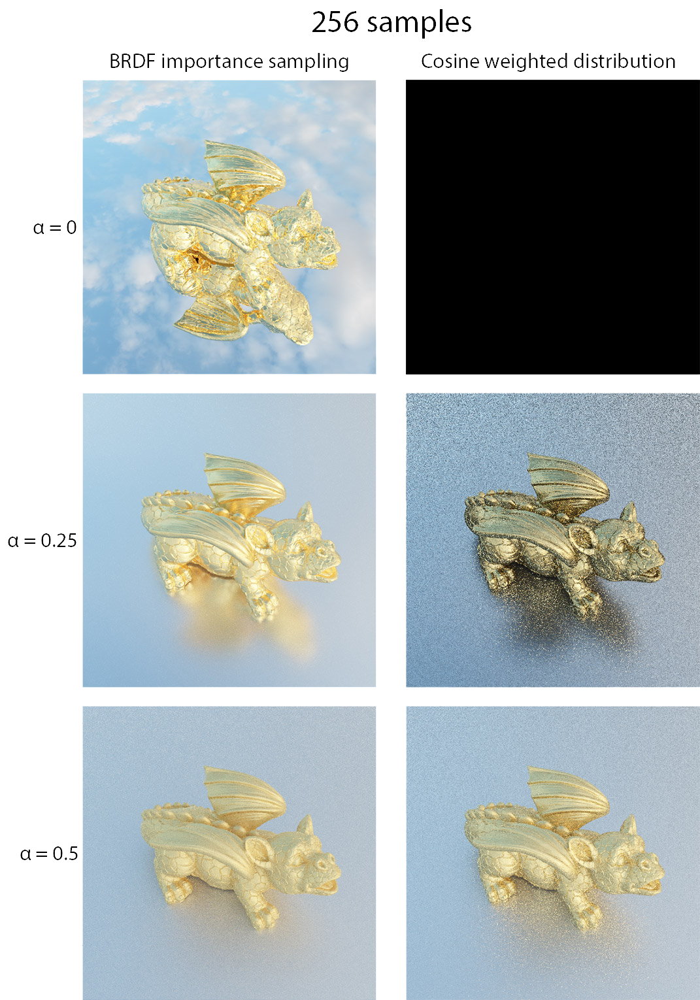
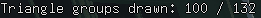
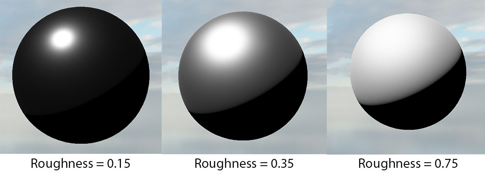
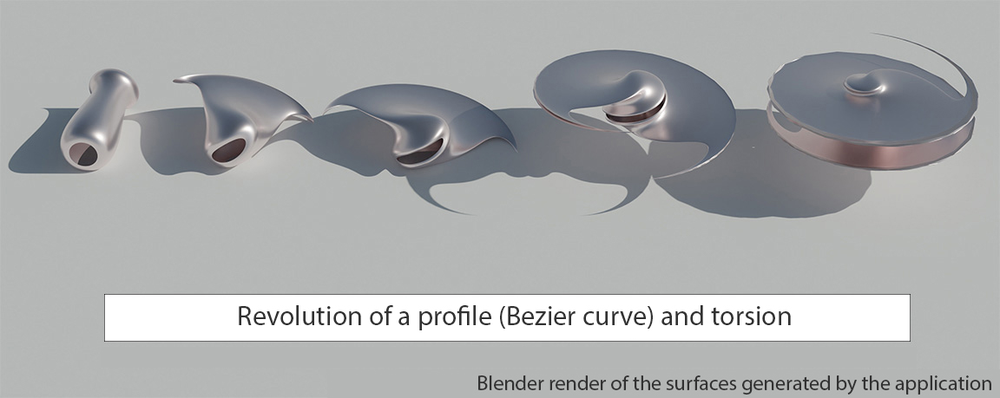

# - M2-
## \[Individuel\] (En cours) Moteur de rendu par path tracing (Monte Carlo) - C++, SYCL
[Base de code](https://github.com/TomClabault/SYCL-ray-tracing)

Moteur de rendu par path tracing (méthode de Monte Carlo) écrit en C++ et utilisant une implémentation du standard SYCL.
SYCL permet l'exécution sur CPU, GPU ou accélérateurs FPGA du même code d'une application C++.

Fonctionnalités implémentées:
- Éclairage direct
- Éclairage indirect (nombre de rebonds arbitraire)
- Modèle de matière à micro facettes (BRDF de Cook Torrance) : Métallique et rugosité
- Échantillonnage préférentiel de la BRDF de Cook Torrance

- Environment map HDR
- Tone mapping HDR (gamma et exposition)
- BVH (hiérarchie de volumes englobants) basée sur un octree + volumes englobants à 7 plans
- Intégration d'Intel® Open Image Denoise
## \[Personnel\] (En cours) Interpréteur 8086 - C++
[Base de code](https://github.com/TomClabault/ComputerEnhance)

Projet personnel en lien avec le cours en ligne "Performance Aware Programming" de Casey Muratori: https://www.computerenhance.com/

Fonctionnalités implémentées:
- Décodage de l'instruction MOV
## \[Individuel\] (Terminé) Moteur de rendu par rastérisation - C++, OpenGL
[Base de code](https://github.com/TomClabault/M2-synthese/tree/master/TPs/from_scratch)

Moteur de rendu temps réel écrit en C++ et utilisant OpenGL.

Fonctionnalités implémentées:
- Intégration de ImGui
- Frustum culling

- Shadow mapping (Percentage closer filtering)
- Modèle de matière à micro facettes (BRDF de Cook Torrance) : Métallique et rugosité

- Textures : Diffuse, métallique, rugosité
- Normal mapping

- Irradiance Mapping (pré calcul de la composante diffuse de l'éclairage à partir d'une environment map)

- Skysphere & skybox
- Tone mapping HDR (gamma et exposition)
## \[Individuel\] (Terminé) Modélisation géométrique (SDF, surfaces de Bézier et déformations de maillages) - C++, Qt6
[Base de code](https://github.com/TomClabault/M2_modelisation)

Modélisation géométrique par SDF (fonctions de distance signée), surfaces de Bézier, surfaces de révolution + fonctionnalités de déformation.

L'algorithme de marching cube pour le maillage des SDF été fourni.
Fonctionnalités implémentées:
- Fonctions de distance signée (SDF)
- Opérateur binaires entre SDF (union, union lisse, intersection, différence, ...)
- Algorithme de ray marching pour le rendu des SDF

- Génération de points sur une surface de Bézier + maillage de la surface
- Déformation locale d'un maillage

- Surface de révolution utilisant une courbe de Bézier comme profil de révolution
- Torsion d'un maillage

## \[Individuel\] (Terminé) Raffinement de maillage 2D (triangulation de Delaunay) - C++
[Base de code](https://github.com/TomClabault/M2_GAM)

Projet de géométrie algorithmique sur des maillages triangulés 2D.

Fonctionnalités implémentées:
- Insertion d'un point à l'intérieur/extérieur d'un maillage et remaillage de la surface
- Algorithme de Lawson pour améliorer la qualité d'un maillage (triangulation de Delaunay)
- Algorithme de Rupert (triangulation de Delaunay contrainte)

# - M1 -

## \[Personnel\] (Terminé) Moteur de rendu par path tracing (Monte Carlo) - C++,  NVIDIA OptiX 7 (Owl)
[Base de code](https://github.com/TomClabault/Owl-OptiX-7)

Moteur de rendu par path tracing (méthode de Monte Carlo) écrit avec la library [Owl](https://github.com/owl-project/owl), un wrapper autour de OptiX 7, framework de NVIDIA conçu pour les applications de ray tracing tirant parti des accélérateurs matériels des GPU NVIDIA GeForce RTX™.

Fonctionnalités implémentées:
- Éclairage direct
- Éclairage indirect
- Modèle de matière à micro facettes (BRDF de Cook Torrance)
- Textures pour la couleur
- Smooth normals
- Intégration de ImGui
- Intégration de l'AI Denoiser de NVIDIA

## \[En groupe\] (Terminé) Moteur de rendu par ray tracing + rastérisation (hybrid) - C++,  Qt6
[Base de code](https://github.com/TomClabault/RayTracerCPP/tree/main/tp2)

Fonctionnalités implémentées:

- Interface entièrement faite avec Qt6 C++

- Rendu par lancer de rayons
- Rendu par rastérisation
- Algorithme de clipping en clip space
- Rendu hybride (rastérisation pour la visibilité, lancer de rayons pour le shading)
- Ombres franches (lancer de rayons secondaires)

- BVH (hiérarchie de volumes englobants) basée sur un octree + volumes englobants à 7 plans
- Réflexions floues (rugosité)
- Normal mapping
- Diffuse texture, roughness map, ambient occlusion map
- Parallax occlusion mapping
- Skysphere

La géométrie de la sphère est parfaitement lisse. L'effet de relief des triangles sur la sphère est dû uniquement à l'algorithme de parallax mapping.
- Skybox
- Super Sampling Anti Aliasing (SSAA)
- Implémentation AVX2 (speedup x8) de Screen Space Ambient Occlusion (SSAO)

## \[En groupe\] (Terminé) Détection de contours (filtres de Sobel, Prewitt) et de lignes (transformée de Hough) C++, OpenCV
[Base de code](https://github.com/TomClabault/AnalyseImage)

Fonctionnalités implémentées:
- Méthode de seuillage local (utile lorsqu'une même image contient des variations de luminosité):
La partie en haut à droite de la grille de sudoku est plus lumineuse que la partie en bas à gauche. Une méthode de seuillage global pour filtrer les contours détectés est inefficace:

La moitié des contours ne sont pas détectés puisqu'ils ne passent pas le seuillage.

Une méthode de seuillage local est bien plus efficace:

Le niveau de seuillage est ajusté en fonction de la luminosité locale de l'image, les variations de luminosité globale de l'image affectent donc très peu cette méthode et les résultats sont bien meilleurs qu'avec une méthode de seuillage global.

- Transformée de Hough (détection de lignes):

De gauche à droite:
1. Détection de contour sur un cube avec un filtre de Kirsch
2. Visualisation des paramètres $\rho$ et $\theta$ des droites détectées dans l'espace de Hough
3. Segments retenus après seuillage de l'espace de Hough et délimitation des droites
# - L3 -
## \[Personnel\] (Terminé) Filtre de Canny (détection de contours) - C, NVIDIA CUDA
[Base de code](https://github.com/TomClabault/CUDAProgramming)

Implémentation du filtre de Canny en C et CUDA pour l'implémentation GPU.

Étapes de l'algorithme de détection:
1. Passage d'un flou gaussien pour réduire les hautes fréquences de l'image (réduit le risque de contours faux positifs à cause du bruit de l'image)
2. Filtre de Sobel pour détecter les contours (gradients)
3. Application d'un seuil pour éliminer les contours (gradients) trop faibles
4. Double thresholding: marquage des contours comme "faibles" ou "forts" en fonction de deux seuils donnés à l'exécution.
5. Hystérésis pour ne garder que les bords significatifs: contour "fort" ou contour "faible" connecté (8 connexité) à un contour "fort"

Source image: wikipedia
## \[En groupe\] (Terminé) Moteur de rendu par ray tracing - Java, JavaFX
[Base de code](https://github.com/TomClabault/RayTracer/)

Moteur de rendu par lancer de rayons (éclairage direct seulement, pas d'estimation de l'équation de rendu) écrit entièrement en Java. L'interface a été réalisée en JavaFX.

Fonctionnalités implémentées:
- Skysphere (non HDR)
- Texture procédurale de damier
- Plans et sphères
- Réflexions floues
- Anti-aliasing SSAA
- Fresnel
- Matériaux réfractifs
- Matériaux miroirs
- Matériaux diffus

## \[En groupe\] (Terminé) Application de gestion de références bibliographiques - Java, JavaFX

Projet de gestion de références bibliographiques visant à faciliter la gestion de dizaines voir centaines de sources lors de l'écriture d'une thèse/article de recherche/…

Fonctionnalités implémentées:
- Ajout / suppression d'une référence dans la base
- Recherche par mots clés
- Affichage dynamique personnalisable des colonnes à afficher

- Édition des références de la base
