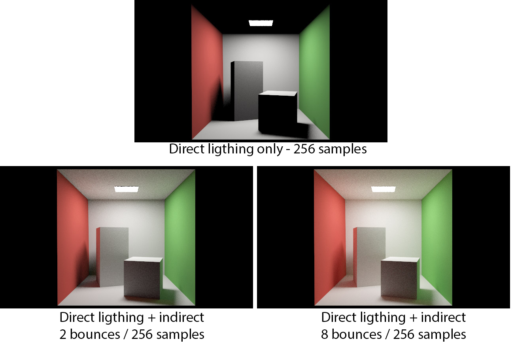
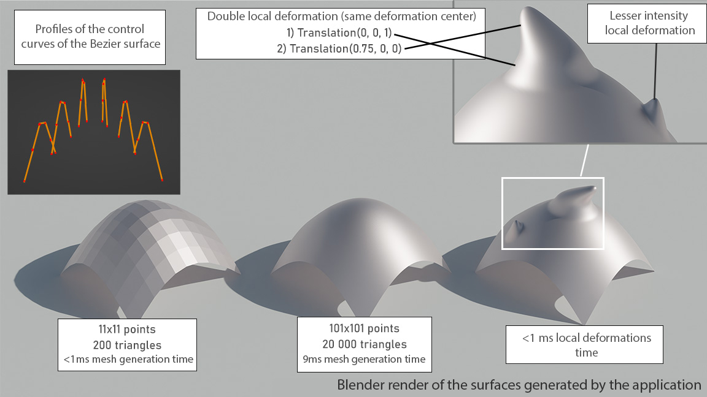

# - M2-
## \[Individual\] (Ongoing) Path tracing rendering engine (Monte Carlo) - C++, SYCL
[Code base](https://github.com/TomClabault/SYCL-ray-tracing)

Path tracing engine written in C++. This project was initially written using SYCL. SYCL is a standard written by the Khronos Group that allows one C++ code to be ran on multiple devices including CPUs, GPUs and even FPGA accelerators. 
Unfortunately, I have been facing issues (discussions with Intel can be found [here](https://community.intel.com/t5/Intel-oneAPI-Data-Parallel-C/SYCL-kernel-hangs-on-long-workloads/m-p/1536759#M3358) and [here](https://community.intel.com/t5/Intel-oneAPI-Data-Parallel-C/Can-t-find-the-source-of-memory-corruption-in-SYCL-ray-tracer/m-p/1539563#M3383)) with SYCL that lead me to reimplement it in pure C++ (the task was pretty much effortless as a SYCL code is already very close to pure C++).

I'd like to rewrite this path tracer with the [HIP RT](https://gpuopen.com/hiprt/) library. This would allow the use of the ray tracing accelerators of RDNA2+ AMD GPUs. An HIP RT application can also be written using the [Orochi](https://gpuopen.com/orochi/) library which allows the application to run on NVIDIA GPUs as well as AMD GPUs (unlike [OptiX](https://developer.nvidia.com/rtx/ray-tracing/optix) which is NVIDIA only).

Implemented features:
- Direct lighting
- Indirect lighting

- Microfacet BRDF (Cook Torrance BRDF) : Roughness and metallic
- Cook Torrance BRDF Importance Sampling

- HDR Environment Map
- Environment Map Importance Sampling
- Multiple Importance Sampling
- Tone mapping HDR (gamma and exposition)
- Octree based BVH + 7 planes bounding volumes
- Linear BVH adapted for GPU computations
- Intel® Open Image Denoise integration
## \[Personnal\] (Ongoing) 8086 Interpreter - C++
[Code base](https://github.com/TomClabault/ComputerEnhance)

Being interested in hardware architecture and software performance, I am following Casey Muratori's online course "Performance Aware Programming": https://www.computerenhance.com/ .

This personnal project is an implementation of the homework given by Casey in his online course.

Implemented features:
- MOV instruction decoding
## \[Individual\] (Done) Rasterization rendering engine - C++, OpenGL
[Code base](https://github.com/TomClabault/M2-synthese/tree/master/TPs/from_scratch)

Real-time rendering engine written in C++ and OpenGL 4.3.

Implemented features:
- ImGui integration
- Frustum culling
- Shadow mapping (Percentage closer filtering)
- Microfacet BRDF : Metallic and roughness

- Textures : Diffuse, mettalic, roughness, normals (normal mapping)
- Normal mapping

- Irradiance Mapping (precomputation of the diffuse irradiance component from an environment map)

- Skyspheres & skyboxes support
- HDR tone mapping (gamma et exposition)
## \[Individual\] (Done) Geometric modeling (SDF, Bezier surfaces and mesh deformations) - C++, Qt6
[Code base](https://github.com/TomClabault/M2_modelisation)

This project implements the representation of implicit surfaces using SDFs  and their meshing using a marching cube algorithm. Some boolean operators are also defined on the SDFs (union, smooth union, intersection, difference, ...).
Signed distance functions are very powerful tools (cf. [Inigo Quilez' Shadertoy profile](https://www.shadertoy.com/user/iq)).
This project also implements revolution surfaces, generation of a mesh from a Bezier surface description and mesh local deformations.

Implemented features:
- Signed distance functions
- Boolean operators on SDFs (union, smooth union, intersection, difference, ...)
- Ray marching algorithm for meshing an SDF

- Meshing of a Bezier surface with arbitrary precision
- Local deformation of a mesh

- Revolution surfaces using a Bezier curve as the revolution profile
- Mesh twisting operator

## \[Individual\] (Done) 2D Mesh refinment (Delaunay triangulation) - C++
[Code base](https://github.com/TomClabault/M2_GAM)

Computational geometry project that manipulates a data structure representing meshes and that allows efficient implementations of computational geometry algorithms. 

Implemented features:
- Insertion of a point outside or inside the convex hull of a triangulation + automatic meshing of the point into the existing triangulation
- Lawson algorithme to improve the quality of an existing triangulation by making a Delaunay triangulation
- Rupert algorithm (triangulation of a planar straight-line graph)

# - M1 -

## \[Personnal\] (Done) Path tracinng rendering engine (Monte Carlo) - C++,  NVIDIA OptiX 7 (Owl)
[Code base](https://github.com/TomClabault/Owl-OptiX-7)

Path tracing rendering engine (Monte Carlo integration) written with the [Owl](https://github.com/owl-project/owl) library, a wrapper around [OptiX](https://developer.nvidia.com/rtx/ray-tracing/optix) 7 which NVIDIA's general (not reserved to rendering) ray tracing framework that can make use of the ray tracing hardware accelerators of NVIDIA GeForce RTX™ GPUs.

Implemented features:
- Direct lighting
- Indirect lighting
- Cook Torrance BRDF
- Diffuse textures
- Smooth normals
- ImGui Integration
- Integration of NVIDIA's OptiX™ AI-Accelerated Denoiser

## \[Individual\] (Done) Ray tracing & rasterization (hybrid) software rendering engine - C++, Qt6
[Code base](https://github.com/TomClabault/RayTracerCPP/tree/main/tp2)

CPU ray-tracer + rasterizer entirely done in C++ and Qt6 for the interface.

Implemented features:

- Qt6 C++ Interface

- Ray tracing rendering
- Rasterization rendering
- Hybrid rendering (rasterization of the visibility + ray tracing for the shading)
- Clip-space clipping algorithme
- Hard shadows (shadow rays)

- Octree based BVH + 7 planes bounding volumes
- Rough reflexions (random ray cast around the normal)
- Normal mapping
- Diffuse texture, roughness map, ambient occlusion mapping
- Parallax occlusion mapping
- Skyspheres support

The mesh of the sphere is perfectly flat (analytic sphere). The perceived geometry is only due to the parallax mapping algorithm.
- Skyboxes support
- Super Sampling Anti Aliasing (SSAA)
- AVX2 Screen Space Ambient Occlusion (SSAO) implementation

- Hair modelisation

## \[Group\] (Done) Edge (Sobel, Prewitt filters) and line (Hough transform) detection - C++, OpenCV
[Code base](https://github.com/TomClabault/AnalyseImage)

Group project that implements some edge and line detection algorithms in an image. OpenCV was used only for loading and displaying images.

Implemented features:
- Local thresholding method (useful when the same image contains variations in brightness):
The top right of the sudoku grid is brighter than the bottom left part of the image. A global thresholding approach is thus ineffective:

Half of the edges aren't detected because one single threshold can only match half of the image.

A local thresholding approach is much more effective:

Le thresholding level is ajusted according to the local brightness of the image. Global brightness changes barely affect this method and the results are way better than those obtained with a global thresholding.

- Hough Transform (line detection):

From left to right:
1. Edge detection of a cube with a Kirsch filter
2. Visualization of the $\rho$ and $\theta$ parameters of the detected lines in Hough space
3. Lines retained after thresholding the Hough space and delimiting the lines.
# - L3 -
## \[Personnal\] (Done) Canny Edge Detection Filter - C, NVIDIA CUDA
[Code base](https://github.com/TomClabault/CUDAProgramming)

Personnal project made with CUDA in pure C that implements the Canny edge detection filter. 

Steps of the detection:
1. Gaussian blur pass to reduce high frequencies in the image (reduces the risk of false positive edge detections due to the noise in the image)
2. Sobel filter to detect edges (gradients)
3. Apply a threshold to eliminate edges (gradients) that are too weak
4. Double thresholding: separates "weak" from "strong" edges according to 2 thresholds given at execution.
5. Hysteresis to keep only significant edges : "strong" edges or "weak" edges connected to a strong edge (8-connexity)

Source image: wikipedia
## \[Group\] (Done) Ray tracing rendering engine - Java, JavaFX
[Code base](https://github.com/TomClabault/RayTracer/)

Ray tracing rendering engine (direct lighting, no rendering equation estimation) entirely written in Java. The interface was written using JavaFX.

Implemented features:
- Skysphere (non HDR)
- Procedural checkerboard texture
- Analytical planes and spheres
- Rough reflexions
- SSAA Anti-aliasing
- Fresnel effect
- Refractif materials
- Mirror materials
- Diffuse materials

## \[Group\] (Done) Bibliographic references management application - Java, JavaFX

The goal of this project was to write an application that can ease the management of dozens if not hundreds of references when writing a thesis/a research paper/...

Implemented features:
- Adding / removing a reference from the base
- Searching in the base by keywords
- Dynamic table display with customizable columns

- Editing the references already in the base
