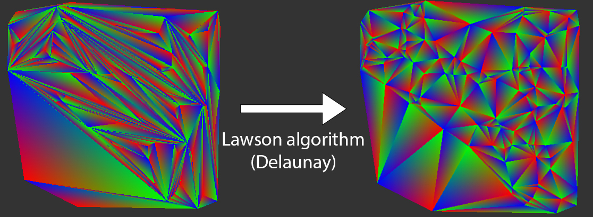

# - M2-
## \[Individual\] (Ongoing) Path tracing rendering engine  (Monte Carlo) - C++, SYCL
[Code base](https://github.com/TomClabault/SYCL-ray-tracing)

Path tracing engine written in C++. This project was initially written using SYCL. SYCL is a standard written by the Khronos Group that allows one C++ code to be ran on multiple devices including CPUs, GPUs and even FPGA accelerators. 
Unfortunately, I have been facing issues (discussions with Intel can be found [here](https://community.intel.com/t5/Intel-oneAPI-Data-Parallel-C/SYCL-kernel-hangs-on-long-workloads/m-p/1536759#M3358) and [here](https://community.intel.com/t5/Intel-oneAPI-Data-Parallel-C/Can-t-find-the-source-of-memory-corruption-in-SYCL-ray-tracer/m-p/1539563#M3383)) with SYCL that lead me to reimplement it in pure C++ (the task was pretty much effortless as a SYCL code is already very close to pure C++).

I'd like to rewrite this path tracer with the [HIP RT](https://gpuopen.com/hiprt/) library. This would allow the use of the ray tracing accelerators of RDNA2+ AMD GPUs. An HIP RT application can also be written using the [Orochi](https://gpuopen.com/orochi/) library which allows the application to run on NVIDIA GPUs as well as AMD GPUs (unlike [OptiX](https://developer.nvidia.com/rtx/ray-tracing/optix) which is NVIDIA only).

Implemented features:
- Direct lighting
- Indirect lighting
- Microfacet BRDF (Cook Torrance BRDF) : Roughness and metallic
- Cook Torrance BRDF Importance Sampling

- HDR Environment Map
- Environment Map Importance Sampling
- Multiple Importance Sampling
- Tone mapping HDR (gamma and exposition)
- Octree based BVH + 7 planes bounding volumes
- Linear BVH adapted for GPU computations
- Intel® Open Image Denoise integration
## \[Personnal\] (Ongoing) 8086 Interpreter - C++
[Code base](https://github.com/TomClabault/ComputerEnhance)

Being interested in hardware architecture and software performance, I am following Casey Muratori's online course "Performance Aware Programming": https://www.computerenhance.com/ .

This personnal project is an implementation of the homework given by Casey in his online course.

Implemented features:
- MOV instruction decoding
## \[Individual\] (Done) Rasterization rendering engine - C++, OpenGL
[Code base](https://github.com/TomClabault/M2-synthese/tree/master/TPs/from_scratch)

Real-time rendering engine written in C++ and OpenGL 4.3.

Implemented features:
- ImGui integration
- Frustum culling
- Shadow mapping (Percentage closer filtering)
- Microfacet BRDF : Metallic and roughness

- Textures : Diffuse, mettalic, roughness, normals (normal mapping)
- Normal mapping

- Irradiance Mapping (precomputation of the diffuse irradiance component from an environment map)

- Skyspheres & skyboxes support
- HDR tone mapping (gamma et exposition)
## \[Individual\] (Done) Geometric modeling (SDF, Bezier surfaces and mesh deformations) - C++, Qt6
[Code base](https://github.com/TomClabault/M2_modelisation)

This project implements the representation of implicit surfaces using SDFs  and their meshing using a marching cube algorithm. Some boolean operators are also defined on the SDFs (union, smooth union, intersection, difference, ...).
Signed distance functions are very powerful tools (cf. [Inigo Quilez' Shadertoy profile](https://www.shadertoy.com/user/iq)).
This project also implements revolution surfaces, generation of a mesh from a Bezier surface description and mesh local deformations.

Implemented features:
- Signed distance functions
- Boolean operators on SDFs (union, smooth union, intersection, difference, ...)
- Ray marching algorithm for meshing an SDF

- Meshing of a Bezier surface with arbitrary precision
- Local deformation of a mesh

- Revolution surfaces using a Bezier curve as the revolution profile
- Mesh twisting operator

## \[Individual\] (Done) 2D Mesh refinment (Delaunay triangulation) - C++
[Code base](https://github.com/TomClabault/M2_GAM)

Computational geometry project Projet de géométrie algorithmique sur des maillages triangulés 2D avec pour but la manipulation d'une structure de données permettant la représentation de maillages ainsi que l'implémentation d'algorithme permettant de manipuler ces maillages.

Fonctionnalités implémentées:
- Insertion d'un point à l'intérieur/extérieur d'un maillage et remaillage de la surface
- Algorithme de Lawson pour améliorer la qualité d'un maillage (triangulation de Delaunay)
- Algorithme de Rupert (triangulation de Delaunay contrainte)

# - M1 -

## \[Personnel\] (Terminé) Moteur de rendu par path tracing (Monte Carlo) - C++,  NVIDIA OptiX 7 (Owl)
[Base de code](https://github.com/TomClabault/Owl-OptiX-7)

Moteur de rendu par path tracing (méthode de Monte Carlo) écrit avec la library [Owl](https://github.com/owl-project/owl), un wrapper autour de OptiX 7 qui est un framework de NVIDIA permettant de concevoir des applications de ray tracing tirant parti des accélérateurs matériels des GPU NVIDIA GeForce RTX™.
C'est par curiosité pour la technologie OptiX que j'ai décidé de me lancer dans ce projet.

Fonctionnalités implémentées:
- Éclairage direct
- Éclairage indirect
- Modèle de matière à micro facettes (BRDF de Cook Torrance)
- Textures pour la couleur
- Smooth normals
- Intégration de ImGui
- Intégration de l'AI Denoiser de NVIDIA

## \[En groupe\] (Terminé) Moteur de rendu par ray tracing + rastérisation (hybrid) - C++,  Qt6
[Base de code](https://github.com/TomClabault/RayTracerCPP/tree/main/tp2)

Projet de lancer de rayons sur CPU dans le cadre de l'UE optionnelle de synthèse d'images en M1. Le sujet du projet n'avait pour but de nous faire implémenter que quelques fonctionnalités de bases telles que les ombres mais par curiosité, de nombreuses autres fonctionnalités ont été implémentées.

Fonctionnalités implémentées:

- Interface entièrement faite avec Qt6 C++

- Rendu par lancer de rayons
- Rendu par rastérisation
- Algorithme de clipping en clip space
- Rendu hybride (rastérisation pour la visibilité, lancer de rayons pour le shading)
- Ombres franches (lancer de rayons secondaires)

- BVH (hiérarchie de volumes englobants) basée sur un octree + volumes englobants à 7 plans
- Réflexions floues (rugosité)
- Normal mapping
- Diffuse texture, roughness map, ambient occlusion map
- Parallax occlusion mapping
- Skysphere

La géométrie de la sphère est parfaitement lisse. L'effet de relief des triangles sur la sphère est dû uniquement à l'algorithme de parallax mapping.
- Skybox
- Super Sampling Anti Aliasing (SSAA)
- Implémentation AVX2 (speedup x8) de Screen Space Ambient Occlusion (SSAO)

- Modélisation de cheveux

## \[En groupe\] (Terminé) Détection de contours (filtres de Sobel, Prewitt) et de lignes (transformée de Hough) C++, OpenCV
[Base de code](https://github.com/TomClabault/AnalyseImage)

Projet de groupe de M1 visant à implémenter quelques algorithmes de détection de contours / lignes dans une image. La librairie OpenCV na été utilisée que pour le chargement et l'affichage des images, pas leur traitement.

Fonctionnalités implémentées:
- Méthode de seuillage local (utile lorsqu'une même image contient des variations de luminosité):
La partie en haut à droite de la grille de sudoku est plus lumineuse que la partie en bas à gauche. Une méthode de seuillage global pour filtrer les contours détectés est inefficace:

La moitié des contours ne sont pas détectés puisqu'ils ne passent pas le seuillage.

Une méthode de seuillage local est bien plus efficace:

Le niveau de seuillage est ajusté en fonction de la luminosité locale de l'image, les variations de luminosité globale de l'image affectent donc très peu cette méthode et les résultats sont bien meilleurs qu'avec une méthode de seuillage global.

- Transformée de Hough (détection de lignes):

De gauche à droite:
1. Détection de contour sur un cube avec un filtre de Kirsch
2. Visualisation des paramètres $\rho$ et $\theta$ des droites détectées dans l'espace de Hough
3. Segments retenus après seuillage de l'espace de Hough et délimitation des droites
# - L3 -
## \[Personnel\] (Terminé) Filtre de Canny (détection de contours) - C, NVIDIA CUDA
[Base de code](https://github.com/TomClabault/CUDAProgramming)

Ce projet personnel a été réalisé lorsque j'ai abotdé CUDA pour la première fois. La détection de contour est un algorithme facilement parallélisable d'où ma volonté de l'implémenter en CUDA sur GPU.

Étapes de l'algorithme de détection:
1. Passage d'un flou gaussien pour réduire les hautes fréquences de l'image (réduit le risque de contours faux positifs à cause du bruit de l'image)
2. Filtre de Sobel pour détecter les contours (gradients)
3. Application d'un seuil pour éliminer les contours (gradients) trop faibles
4. Double thresholding: marquage des contours comme "faibles" ou "forts" en fonction de deux seuils donnés à l'exécution.
5. Hystérésis pour ne garder que les bords significatifs: contour "fort" ou contour "faible" connecté (8 connexité) à un contour "fort"

Source image: wikipedia
## \[En groupe\] (Terminé) Moteur de rendu par ray tracing - Java, JavaFX
[Base de code](https://github.com/TomClabault/RayTracer/)

Projet encadré de plusieurs mois.
Moteur de rendu par lancer de rayons (éclairage direct seulement, pas d'estimation de l'équation de rendu) écrit entièrement en Java. L'interface a été réalisée en JavaFX.
Les objectifs principaux du projet étaient d'implémenter l'algorithme de rendu par lancer de rayons à proprement parler ainsi que des matériaux réfléchissant, réfractifs et diffus.
Le rendu obtenu tel que présenté ci-dessous a donc nécessité l'implémentation d'un bon nombre de fonctionnalités supplémentaires telles que l'environnement, les textures procédurales de damier, les réflexions floues, l'anti-aliasing, ...

Fonctionnalités implémentées:
- Skysphere (non HDR)
- Texture procédurale de damier
- Plans et sphères
- Réflexions floues
- Anti-aliasing SSAA
- Fresnel
- Matériaux réfractifs
- Matériaux miroirs
- Matériaux diffus

## \[En groupe\] (Terminé) Application de gestion de références bibliographiques - Java, JavaFX

Projet encadré de plusieurs mois en mode agile visant. Le but était de créer une application de gestion de références bibliographiques visant à faciliter la gestion de dizaines voir centaines de sources lors de l'écriture d'une thèse/article de recherche/…

Fonctionnalités implémentées:
- Ajout / suppression d'une référence dans la base
- Recherche par mots clés
- Affichage dynamique personnalisable des colonnes à afficher

- Édition des références de la base
